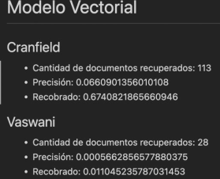
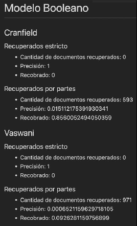

# Proyecto Sistema de Recuperación de Información

__Integrantes:__

Luis Alejandro Lara Rojas C-512
Richard García De la Osa C-512
Carlos Alejandro Arrieta Montes de Oca C-512

### Desarrollo y composición del proyecto

El proyecto está desarrollado en python y sigue los siguientes pasos:

1-Procesamiento del lenguaje.

2-Implementación de los modelos escogidos.

3- Implementacion de la interfaz visual.

4-Pruebas y evaluación de métricas.

5-Conclusiones.

### Desarrollo de los modelos

En nuestro caso nos decidimos por el modelo vectorial al principio, que, a pesar de ser un poco más complicado de implementar que el modelo booleano, para uso general ha demostrado brindar mejores resultados, además de brindar un ranking. Luego implementamos el modelo booleano para comparar resultados en escenarios distintos.

No es objetivo de este trabajo explicar cómo funciona el modelo vectorial, pero estaremos explicando brevemente qué hicimos en el archivo __vectorial_model.py__, en el cual se encuentra toda la lógica del modelo La clase __VectorialModel__ se debe crear pasándole a su constructor un diccionario del mismo formato de __dataset.json__ y esta contiene las funciones __tf__ e __idf__, __calculateWQuery__ que se encarga de calcular los pesos de una consulta dada, la función __sim__ es la que calcula la similitud dada una consulta y un documento, etc.

La función __search__ tiene como labor devolver dada una consulta los documentos relevantes, para ello por cada documento llama a la función __sim__, y considera devolver un documento siempre que su similitud con la consulta sea mayor o igual a un umbral al cual le dimos valor 0.6.

En caso del modelo booleano se utilizaron consultas de la forma "palabra" o "no palabra". En este caso en el archivo __boolean_model.py__, el metodo __boolean_retrieve__ se encarga de dada la consulta revisar los documentos que se van a recuperar. En este caso se devuelven dos coleciones la primera resultado de aplicar estríctamente el modelo y la segunda aplicando la modificación sobre relajar la condición del modelo booleano.

Al igual que el modelo vectorial, recibe un diccionario con el formato del __dataset.json__ y tiene una función __search__ que es la que devuelve las dos colecciones con los documentos recuperados en el formato mencionado anteriormente.

### Procesamiento de los documentos.

Nuestra primera tarea fue procesar los documentos y transformarlos en una estructura más facil de utilizar para nosotros, para ello transformamos el archivo cran.all.1400 a un archivo en formato .json que nos permitiera operar mejor sobre los documentos. Auxiliándonos de la biblioteca spacy eliminamos del texto elementos que no nos aportaran mucha información, tales como signos de puntuación, conjunciones, preposiciones, etc (stopwording y stemming).

Finalmente exportamos, luego del procesamiento, en el archivo dataset.json toda la información sobre los documentos, donde incluimos por cada documento un diccionario con las palabras y su frecuencia en cada texto
La implementación de todo este proceso se encuentra en el archivo __text_processing.py__, encapsulado en las siguientes funciones:
__processing_text:__ función encargada dado un texto removerle los signos de puntuación y los stopwords.
__read_docs:__ función encargada de leer el archivo cran.all.1400 y transformarlo en una estructura computacional (diccionario), en el camino procesaba el texto usando la función __processing_text__ mencionada anteriormente.
__dataset_prcessing:__ esta funciona como un wrapper de las 2 anteriores, ya que se encarga de devolver el __dataset.json__ previamente creado, o, en caso de este no existir crearlo haciendo todo el procesamiento anteriormente explicado, también tiene la opción de modificar el __dataset.json__ en caso de se hayan modificado los datos, esta última pasándole el parámetro override en "True".
__query_processing:__ básicamente su tarea es, utilizando __processing_text__ procesar las queries para eliminar todos los elementos que nos resulten indiferentes, tales como signos de puntuación, etc.

### Análisis de las métricas

Para medir la efectividad del modelo implementado se decidió utilizar las métricas __precisión__, __recobrado__ y __F1__. En el módulo __evaluation.py__ se tienen los métodos __recover_value__ y __precision_value__  que calculan para una consulta los valores anteriormente mencionados respectivamente. Como estos valores se calculan respecto a alguna de las consultas almacenadas, reciben como párametro el número de la consulta sobre la cual se quiere calcular la métrica. Luego, apoyándose en las funciones para calcular los conjuntos de Documentos Recuperados, Documentos Relevantes y Documentos Recuperados Relevantes devuelve el valor de la métrica correspondiente.

Además de estas funcionalidades se agregaron los métodos __recover_mean__, __precision_mean__ y __f_mean__, que calculan el promedio de los valores de las métricas con respecto a todas las consultas almacenadas.

Luego de este análisis obtuvimos una media en la tasa de recobrado de un 68% y una pobre media en la precisión de un 7%, esto se debe a que en nuestro parámetros sacrificamos en precisión en pro del recobrado, ya que retornamos un documento si su similitud con la consulta es mayor o igual a 0.6, colocando un mayor valor en este parámetro obteníamos mejor precisión pero se veía afectado el recobrado, y decidimos por priorizar este último.

En el caso del Boleano los valores para las metricas son bastante variables dado que este modelo suele o devolver muchos documentos o casi ninguno por lo que la precisión y el recobrado no tienen resultados muy esperados. Por esto decidimos "modificar" el modelo para que no solo devolviese estrictamente los documentos que cumpliesen el modelo booleano, sino cuantificar que tan cercanos a la consulta estaban y devolver acorde a esto. Al hacer este cambio hay una mejora en cuanto al recobrado pero la precisión sigue siendo muy mala. Podemos observar que en estos casos se recuperaron 0 documentos usando el modelo estrictamente.

### Conclusiones

Nuestros modelos obtuvieron una buena tasa de recobrado, en nuestra opinión, pero no fue el caso con la tasa de precisión, para mejorar esto deberiamos probar con otros valores en los parámetros de los modelos, así como mejorar el procesamiento del texto usando otras bibliotecas y/o técnicas de machine learning. También utilizar otras técnicas de retroalimentación para mejorar los resultados y talvés usar otras métricas para ampliar el espectro de comparación entre ambos modelos y poder determinar con mayor seguridad en que casos sería mejor utilizar alguno de ellos.
